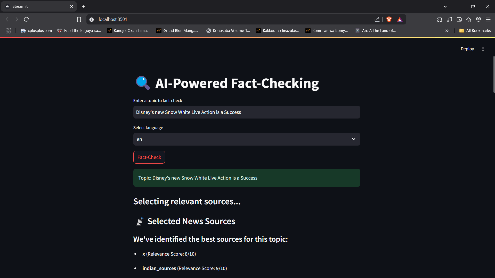

# Agentic AI Misinformation Detection
This repository contains an AI-driven misinformation detection system that fetches news, analyzes credibility, generates relevant images, and provides confidence scores for detected misinformation. The system utilizes Ollama for local LLM inference and operates fully on local machines.

---
## 📂 Project Structure
```
.
├── Dockerfile                
├── LICENSE                   
├── README.md                 
├── app.py                    
├── logs/                      
│   ├── continuous_logs.log    
├── main.py                   
├── requirements.txt           
├── src/                       
│   ├── __init__.py            
│   ├── project/               
│   │   ├── __init__.py        
│   │   ├── components/        
│   │   │   ├── __init__.py    
│   │   │   ├── agents.py      
│   │   │   ├── config/        
│   │   │   │   ├── __init__.py
│   │   │   ├── fetch_news.py  
│   │   │   ├── generate_blog.py 
│   │   │   ├── generate_image.py 
│   │   │   ├── logging/       
│   │   │   │   ├── __init__.py
│   │   │   ├── confidence_score.py 
│   │   ├── __pycache__/       
│   ├── __pycache__/           
├── template.py               
```
---
## 🚀 Installation & Setup
### 1️⃣ Clone the Repository
```sh
git clone https://github.com/YourUsername/MisinformationAgent.git
cd MisinformationAgent
```
### 2️⃣ Create a Virtual Environment (Optional but Recommended)
```sh
python -m venv venv
source venv/bin/activate  # On macOS/Linux
venv\Scripts\activate  # On Windows
#or
conda create -p venv python==3.12 -y
conda activate venv/
```
### 3️⃣ Install Dependencies
```sh
pip install -r requirements.txt
```
### 4️⃣ Set Up Ollama for Local Inference
Ollama is required to run local LLM models for misinformation analysis.
Install Ollama:
```sh
curl -fsSL https://ollama.ai/install.sh | sh
```
Start the Ollama model:
```sh
ollama run mistral
```
### 5️⃣ Run the Application
```sh
streamlit run main.py
```
---
## 🛠 Usage Guide
1. Run the script and input a news topic or URL.
2. The system fetches relevant news from trusted sources.
3. It evaluates credibility using LLM-based analysis.
4. The system generates an AI-enhanced confidence score.
5. The images stored in the `images/` folder are displayed to provide visual insights.

### 🖼 Preview
---

---
## 📜 License
This project is licensed under the terms of the `LICENSE` file included in the repository.
---
## 🤝 Contributions
Feel free to open issues or create pull requests to improve the project!
### Contributors
- Siddharth Karmokar

